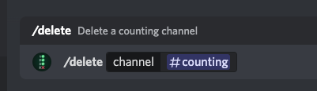

# BetterCounting
Developed by [Landon Boles](https://github.com/TheLDB)

## What is this bot?
Counting bot allows you to count with your community in public channels on Discord!

## How does it work?

### Counting
To continue the count in a channel, you have two options!

Either you can use standard numbers, 1, 2, 3, 16, 25, etc...

Or you can use Math expressions!

If the number is 3, send 2+2, it equals 4 so you'll move on. You can also use more advanced equations, that result in decimals, however your answer from the equation needs to be within 1/100 of the correct answer!

For example, if the next number is 66, and you send ``8.1240^2``, it'll work since ``65.999376`` is within 1/100 of 66.

### Registering Channels
This bot has support for multiple channels, only Administrators can register or delete channels

To register a channel for counting, run ``/register {channel}``

If you'd like to set a custom increment while registering, you can also use the optional increment option when using ``/register`` - Don't worry though, you can always change this later

### Setting a custom increment
If you'd like to change the increment number for counting, to 5 for example, Administrators can run the ``/updateincrement {channel} {increment}`` command. 

You can set the increment to whole numbers, negative numbers, or decimals to the hundredth.

### Viewing the leaderboard
This counting bot has a leaderboard! You can either view a leaderboard for a specific counting channel, or the entire server. 

To view this, users can run ``/leaderboard {channel}``, but keep in mind, the channel argument is optional. If you'd like full server stats, you can leave that argument blank

### Viewing a users score
If you'd like to get yours, or someone elses counting score, users can run the ``/score {user}`` command.

The user argument is optional, if you'd like your score, you can leave it blank.

### Viewing a channels current & highest score
Want to know what a channel is at, or how far they've gotten in the past? Use the ``/channelscore {channel}`` command.

The channel argument is optional, if you'd like the current channel's score, you can leave it blank.

### Deleting/Deregestering a channel
If you'd like to stop counting in a channel, Administrators can run the ``/delete {channel}`` command. 

Don't worry if you accidentally deregistered a channel though, if you re-register, you'll keep your history and your counting state.

## How does score work?
All users start off with ``0`` score. 
If you contribute to a counting channel and the number was correct, you'll gain one point. 

However, if you contribute and it was incorrect, causing the channel to restart, you'll lose 5 points, so be careful!