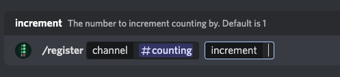

# CountingBot
Developed by [Landon Boles](https://github.com/TheLDB)

** Image here once bot is done **

## What is this bot?
Counting bot allows you to register (and delete) specific channels, and count with your community.

1, 2, 3, 4, 5, 6.... you get the jist!

## How does it work?

### Registering/Deleting Channels
If you're an Administrator, you have the abillity to register and delete channels!

To register a new channel, simply run /register [channelName]

To delete a channel, just use /delete [channelname]

### Counting
Well... just count, be sure not to skip any numbers though!

** Image here once done ** 